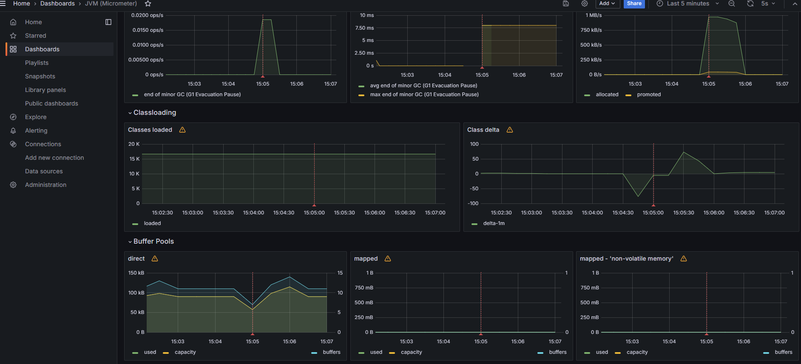

<p>Jobs Manager</p>

This repository contains a backend solution that allows managing job vacancies and candidates.

### Conteúdo do repositório

- [x] Spring Boot/Spring security
- [x] Tests unitários
- [x] Tests de integração
- [x] PostgreSQL
- [x] Spring Actuator
- [x] Prometheus
- [x] Grafana

## Fazer o clone do repositório

`$ git clone https://github.com/souzarogih/`

### Mapa de Endpoints da API

- [x] /candidate/auth
- [x] /candidate/
- [x] /candidate/job
- [x] /candidate/job/apply
- [x] /company/auth
- [x] /company/job/

### Tabelas do banco de dados

| Table | Description |
|-------|-------------|
|   apply_jobs    |    Table with job applicants' applications.         |
|    candidate   |     Table with candidates' records.        |
|    company   |     Table with companies' records.        |
|    job   |      Table of job vacancies.       |

### 🎲 Rodando a aplicação

```bash
# Comando para executar no Docker  
$ docker-compose up

# O servidor inciará na porta:8000 - acesse <http://127.0.0.1:8087/>
```

### Documentação

#### Diagrama simplificado do serviço


[Swagger](http://localhost:8080/swagger-ui/index.html#/)

### Sonarqube
`http://localhost:9000/maintenance?return_to=%2F`

u: `admin`
s: `admin`


### Executar o teste do sonar manualmente pelo terminal
```
mvn clean verify sonar:sonar \
-Dsonar.projectKey=gestao_vagas \
-Dsonar.host.url=http://localhost:9000 \
-Dsonar.login=sqp_34b718e0308bacee6ab48f2798f6fcc7e2823f56
```

### Observabilidade

- Actuator
`http://localhost:8080/actuator`

#### Prometheus
`http://localhost:9090/`


#### Grafana
`http://localhost:3000/`
user: admin
password: admin




#### Links úteis
[Actions do git actions](https://github.com/orgs/actions/repositories?type=all)

Autor
---

<a href="https://github.com/souzarogih">
 
 <br />
 <sub><b>Higor Souza</b></sub></a> <a href="https://github.com/souzarogih" title="Rocketseat">🚀</a>


[](https://twitter.com/i/redirect?url=https%3A%2F%2Ftwitter.com%2FHigorSouza04&t=1&cn=bG9naW5fbm90aWZpY2F0aW9uX2VtYWls&sig=a0e0273dce32a5c70e3ef154782b2ce5c4a5ef53&iid=cb7ce91830aa4ed4a58b1b4e7edbbfff&uid=343469291&nid=296+1)
[](https://www.linkedin.com/in/higor-souza-aab27051/)
[](mailto:rogih.andrade@gmail.com)
[](mailto:higor.andrade@hotmail.com)
[](https://github.com/souzarogih)

### Readme personalizado através dos seguintes links

- [Como-fazer-um-bom-readme](https://blog.rocketseat.com.br/como-fazer-um-bom-readme/)
- [Thiago Marinho](https://gist.github.com/tgmarinho/931ce1ad6de9c24c7f3b6d7848de9fbd)
- [GitHub Markdown](https://github.com/ekalinin/github-markdown-toc#table-of-contents)
- [Shields](https://shields.io/)
- [List of Badges, in Markdown](https://github.com/Naereen/badges)